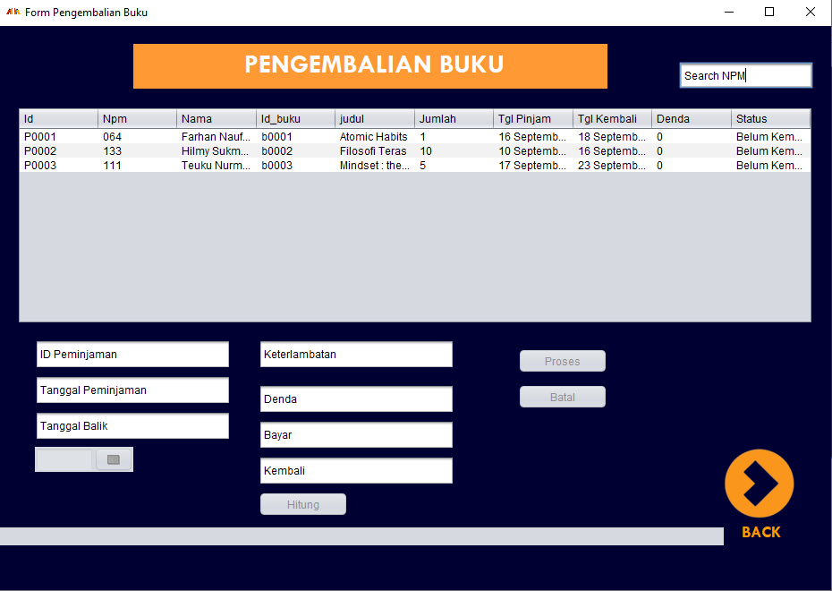

# 
**Dokumentasi Aplikasi Perpustakaan**

## **Gambaran Umum Sistem**
Perpustakaan merupakan salah satu sumber informasi dalam dunia pendidikan. Perpustakaan secara umum memiliki fungsi dalam pencatatan peminjaman dan pengembalian buku, inventaris buku, dan lain sebagainya. Terdapat beberapa permasalahan apabila fungsi yang banyak tersebut dilakukan secara manual. Oleh karena itu, dikembangkan sebuah aplikasi perpustakaan yang dapat menjalankan fungsi perpustakaan secara umum dengan kompleks. Aplikasi Perpustakaan merupakan aplikasi desktop yang dikembangkan menggunakan bahasa pemrograman Java. Aplikasi ini khusus digunakan untuk administrator perpustakaan, yang memiliki beberapa fungsi di dalamnya, antara lain yaitu : 
1. Melakukan login
2. Melakukan logout 
3. Melakukan input buku dan mahasiswa 
4. Melakukan update data buku dan mahasiswa
5. Menampilkan data buku dan mahasiswa 
5. Menghapus data buku dan mahasiswa
6. Menampilkan data buku dan mahasiswa
7. Melakukan pencatatan peminjaman dan pengembalian buku

## **Manfaat/Kegunaan Aplikasi**
Aplikasi Perpustakaan memiliki manfaat sebagai berikut : 
1. Memudahkan administrator dalam pencatatan peminjaman dan pengembalian buku
2. Sebagai penyedia catatan atau *database* buku apa saja yang dimiliki perpustakaan beserta jumlahnya
3. Meningkatkan efisiensi kinerja perpustakaan dari sistem manual ke sistem digital
4. Menyajikan update informasi secara cepat dan tepat 

## **Fitur Keamanan Aplikasi**
Terdapat 3 fitur keamanan yang diimplementasikan pada Aplikasi Perpustakaan. Fitur tersebut antara lain :   
**1. Mekanisme Login**  
Mekanisme login bertujuan agar aplikasi hanya dapat diakses oleh pihak tertentu yaitu admin perpustakaan. Akun admin berupa *username* dan password yang disimpan di dalam *database* dengan password berupa nilai hash yang dienkripsi menggunakan SHA 256. 

**2. Sanitasi Input**  
Sanitasi input diterapkan pada kolom masukan dari pengguna yang bertujuan agar pengguna tidak memberikan input yang akan merusak atau membahayakan aplikasi. Sanitasi input ini diterapkan pada login dimana pengguna hanya dapat memasukkan huruf kecil pada kolom username, input NPM pada halaman input mahasiswa dan input stok (jumlah buku) pada halaman input buku yang hanya menerima input angka.

**3. *Suspicious Comments***  
Aplikasi Perpustakaan menerapkan *suspicious comments* dengan tidak menampilkan peringatan atau output yang akan mengundang perhatian penyerang. Contohnya pada proses login, hanya akan mengeluarkan output "Login gagal" jika salah memasukkan username atau password sebagai ganti dari "Username salah" atau "Password salah".

## **Kebutuhan Aplikasi**
Kebutuhan yang dibutuhkan untuk menjalankan Aplikasi Perpustakaan antara lain : 
1. Aplikasi server lokal XAMPP  
Aplikasi ini digunakan untuk memasukkan *database* yang berisi informasi yang dibutuhkan aplikasi.
2. Java Version 
Aplikasi Perpustakaan membutuhkan java dengan versi minimum 1.8.0 dan maksimum 1.9.0. 

Pada halaman utama terdapat 5 menu utama, yaitu Data Mahasiswa, Data Buku, Peminjaman Buku, Pengembalian Buku, dan Logout. 

   
  Gambar 5

__1. Data Mahasiswa__  
Menu ini dilengkapi dengan penambahan, update, dan hapus data mahasiswa. Selain itu pengguna dapat melakukan pencarian data mahasiswa menggunakan NPM Mahasiswa. 

   
  Gambar 6

__2. Data Buku__  
Menu ini dilengkapi dengan penambahan, update, dan hapus data buku. Selain itu pegguna dapat melakukan pencarian data buku menggunakan ID Buku. Contoh : B0001 

   
  Gambar 7

__3. Peminjaman Buku__  
Menu ini dilengkapi dengan penambahan dan hapus data peminjaman buku.Selain itu pengguna dapat melakukan pencarian data peminjaman menggunakan ID peminjaman. Contoh : P0001. Input pada peminjam buku harus sesuai dengan data mahasiswa yang terdaftar dalam _database_. Input peminjam bergantung pada NPM yang secara otomatis akan melakukan pengisian pada kolom Nama Mahasiswa. Input buku yang dipinjam bergantung pada ID buku yang terdaftar dalam _database_ yang secara otomatis akan melakukan pengisian pada judul buku yang dipinjam. 

   
  Gambar 8

__4. Pengemblian Buku__  
Menu ini dilengkapi dengan pemrosesan data pengembalian buku yang berdasarkan data peminjaman yang dapat menghitung denda apabila peminjam melewati tanggal pengembalian yang ditetapkan. Button proses digunakan untuk menghapus data peminjam yang mengembalikan/membayar denda. 

   
  Gambar 9

